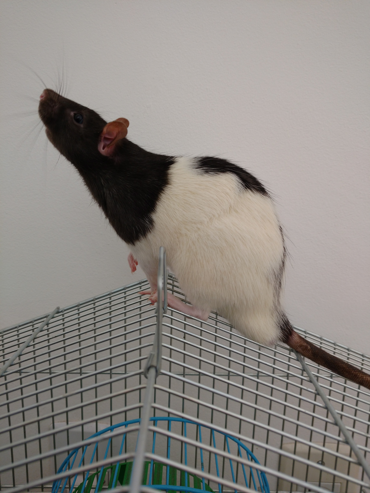

  <h3 align="center">Research Papers</h3>

  

    Interests and Themes
  

  

    Discrete dynamical systems, Ergodic Theory
   

## Papers

- [Introduction to Julia Sets](https://docs.ufpr.br/~ewkaras/ic/AndreKowacs2018.pdf)
- [Studies on the Pea Pattern Sequence ](https://arxiv.org/abs/1708.06452)
- [Grupos de Lie](artigos/main.pdf)
- [Exponential Taylor Series](https://arxiv.org/abs/2212.03171)
- [Global solvability and hypoellipticity for evolution operators on tori and spheres](https://arxiv.org/abs/2306.15583)
- [Fourier Analysis on T^m×R^n and Applications to Global Hypoellipticity](https://arxiv.org/abs/2306.15578)

